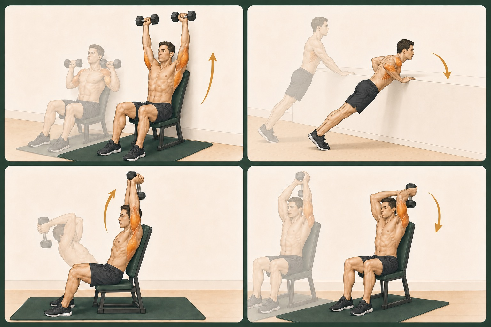
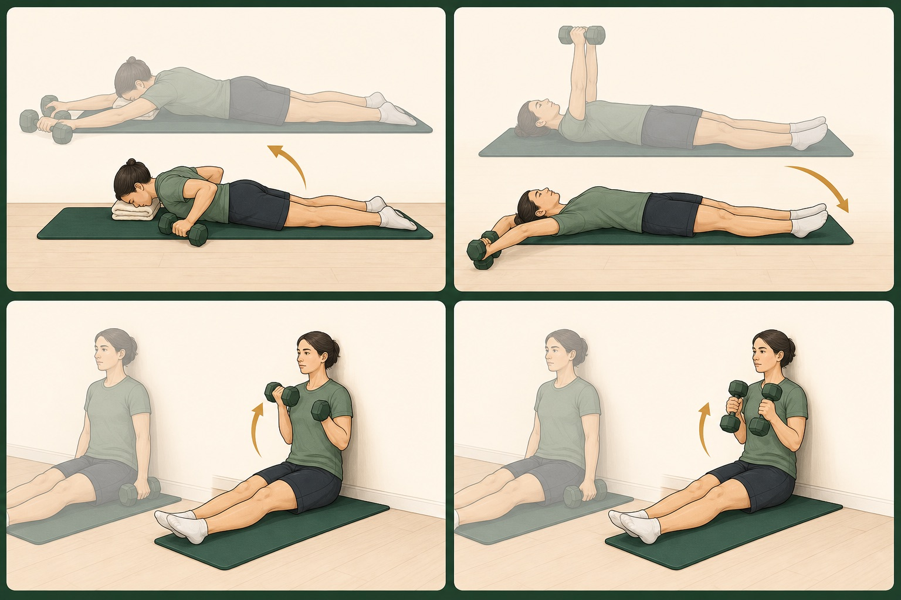
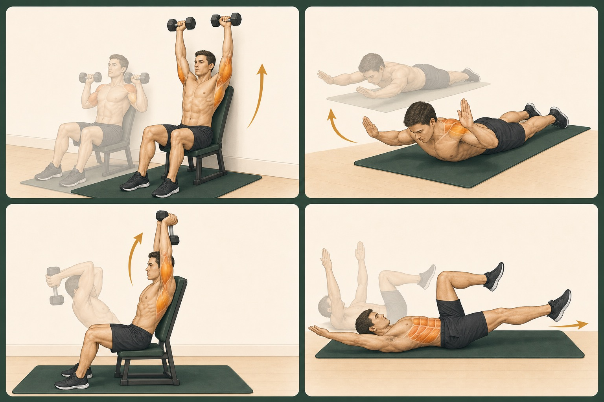

# Lộ trình phục hồi ACL → trở lại bóng đá chuyên nghiệp

**Bối cảnh:** Mổ tái tạo dây chằng chéo trước (ACL) bằng mảnh ghép **gân cơ mác dài (peroneus longus)** lấy **cùng chân phải** — chân được mổ, **kỹ thuật all-inside**. **Không đụng đến sụn chêm** (không khâu, không cắt). **Ngày mổ: 08/07/2026.** Theo cập nhật thực tế, đã **đủ 6 tuần và bỏ nạng từ 19/08/2026**. **Vị trí thi đấu:** tiền vệ trung tâm / chạy cánh.

> 🔧 **Về kỹ thuật all-inside:** dùng đường hầm mù (socket) + cố định treo vòng chỉnh được (adjustable-loop) ở cả hai đầu, cần mảnh ghép ngắn hơn (hợp với gân cơ mác). Với kiểu cố định treo, một số bác sĩ thận trọng hơn với chịu lực sớm để bảo vệ điểm neo lúc mảnh ghép liền vào đường hầm — **có thể** là một phần lý do NWB 6 tuần + giới hạn gấp sớm. Càng là lý do để tuân thủ nghiêm chỉ định.

> 🩹 **Chỉ định của bác sĩ mổ (ưu tiên cao nhất):**
> - **Tuần 0–6:** không chống chân (NWB), dùng nạng.
> - **Tầm vận động:** tuần 0–2 gấp tối đa 90° + lấy hết duỗi (0°); sau đó **tăng gập +5°/tuần**.
> - **✅ Cập nhật trạng thái cá nhân:** ngày mổ **08/07/2026**; đã **bỏ nạng từ 19/08/2026**, khi đủ 6 tuần sau mổ.
>   - Mức chịu lực, dáng đi và các bài đứng tiếp tục theo chỉ định mới nhất của bác sĩ/KTV.
>   - Tiếp tục **gập +5°/tuần**, duỗi giữ 0°.
>
> → Bạn đã qua mốc chuyển từ NWB sang **chịu lực dần (GĐ2.5)** và đã bỏ nạng. Vẫn thận trọng: chưa squat/lunge nặng, chưa đứng 1 chân hoàn toàn, chưa chạy nếu chưa được KTV/bác sĩ cho phép.

> ❓ **Đã rõ sau cập nhật:** đã bỏ nạng từ đủ 6 tuần và nhịp gập (+5°/tuần). **Còn nên xác nhận:** (1) đã được tập nhấc thẳng chân (SLR) chưa; (2) mức chịu lực hiện tại; (3) bác sĩ/KTV đã cho phép những bài đứng nào — với mục tiêu chuyên nghiệp, rất nên có người theo sát.

> ⚠️ **Đọc trước khi bắt đầu.** Tôi là AI, không phải bác sĩ hay KTV vật lý trị liệu. Đây là **khung tham khảo dựa trên phác đồ chuẩn**, không thay thế chỉ định của ê-kíp mổ và KTV đang theo dõi trực tiếp gối bạn. Hãy dùng tài liệu này để **trao đổi với họ**, và luôn ưu tiên chỉ định riêng của họ nếu khác với bên dưới.

---

## Hai nguyên tắc quan trọng nhất

**1. Tiến theo TIÊU CHÍ, không theo lịch.** Mốc thời gian bên dưới chỉ là ước lượng. Bạn chỉ chuyển sang giai đoạn kế tiếp khi **đạt đủ tiêu chí thoát (exit criteria)** của giai đoạn hiện tại, dù có đến sớm hay muộn hơn lịch. Chạy quá nhanh là nguyên nhân hàng đầu gây đứt lại mảnh ghép.

**2. Điểm đặc thù của gân cơ mác: phải chăm cả "nơi cho gân" ở cổ chân.** Khác với gân kheo, mảnh ghép này lấy ở mặt ngoài cẳng chân/mắt cá ngoài. Vết lấy gân thường ít biến chứng, nhưng bạn cần chủ động phục hồi **sức mạnh lật ngoài bàn chân (eversion)** và **thăng bằng cổ chân** song song với gối, nếu không cổ chân yếu sẽ thành mắt xích lỏng khi bạn đổi hướng, sút bóng.

---

## 📝 Ghi chú sau review chuyên môn (giả lập) — cần xác nhận với ê-kíp thật

**Từ góc bác sĩ phẫu thuật:**
- **Gấp gối:** giữ ≤ 90° cho tới khi bác sĩ tái khám và cho phép — không tự nong qua 90° (đã sửa trong toàn tài liệu).
- **Cấm bài duỗi gối chuỗi mở có kháng lực** (máy đá đùi 90°→0°) trong ~3–4 tháng đầu — căng ACL mạnh ở đoạn gần duỗi hết. Ưu tiên bài chuỗi đóng (squat, leg press) khi tới GĐ tập sức mạnh.
- **Không xoay/vặn trên chân trụ** cho tới khi được "clear".
- **Xác nhận** có làm thêm thủ thuật dây chằng ngoài (LET/ALL) không — nếu có, phác đồ sẽ khác.
- **Báo bác sĩ** nếu tê bì mặt ngoài cẳng chân/mu chân hoặc yếu lật ngoài kéo dài (thần kinh mác nông gần vùng lấy gân).

**Từ góc bác sĩ phục hồi chức năng / KTV:**
- **Kích thích điện cơ (NMES)** lên cơ đùi trước trong GĐ không chịu lực — chống "cơ đùi ngủ quên", dùng kèm quad set nếu có máy.
- **Tập hạn chế dòng máu (BFR)** tải nhẹ để giữ khối cơ khi chưa tải nặng được — cần KTV có kinh nghiệm hướng dẫn.
- **Đo khách quan ở các cửa:** lực đẳng động (isokinetic) cho sức mạnh, force plate/thảm cho test nhảy. Trước chạy: sức mạnh đùi ~≥ 70–80%; trước cắt hướng/thi đấu: ≥ 90% + chất lượng động tác. Đo vòng đùi theo dõi teo cơ.
- **Tràn dịch/sưng là "đèn giao thông" số một** — sưng sau tập = quá tải, lùi lại (quan trọng hơn cả đau).
- **Lợi thế của bạn:** gân kheo và cơ chế duỗi gối còn nguyên (không lấy gân kheo/bánh chè) → hai nhóm này thường hồi phục mượt hơn; **điểm canh riêng vẫn là cổ chân**.
- **Nền tảng liền mô:** ngủ đủ, đủ đạm, quản lý tải — đưa vào kế hoạch, không phải chuyện phụ.

---

## Bản đồ tổng thể 7 giai đoạn

| GĐ | Thời gian ước lượng | Trọng tâm |
|----|--------------------|-----------|
| 1 | Tuần 0–2 (đã qua) | Bảo vệ, hết sưng, duỗi gối hết, kích hoạt cơ đùi trước |
| 2 | Tuần 2–5 (đã qua) | Không chịu lực (NWB) — chống sưng, giữ cơ đùi, tầm vận động, giữ thể lực |
| 2.5 | **Tuần 5–7 (đang ở cuối giai đoạn; đã bỏ nạng ở tuần 6)** | **Chịu lực dần, bỏ nạng từ đủ 6 tuần**, tập lại dáng đi, khởi động sức mạnh đứng nhẹ |
| 3 | Tuần 6–12 | Tăng sức mạnh, cảm thụ bản thể, đạp xe — **chưa chạy** |
| 4 | Tháng 3–5 | Sức mạnh nặng, tập chạy lại, plyometric nhẹ |
| 5 | Tháng 5–7 | Plyometric nâng cao, đổi hướng, khởi động chuyên biệt |
| 6 | Tháng 7–9 | Bóng chuyên biệt, đối kháng nhẹ, đá sân nhỏ |
| 7 | Tháng 9–12 | Test trở lại thi đấu, tập cùng đội, thi đấu |

Trở lại **bóng đá chuyên nghiệp** thường rơi vào **9–12 tháng**, quyết định bằng test chứ không bằng lịch.

---

## GIAI ĐOẠN 1 — Tuần 0–2 (bạn đã qua)

Ghi lại để bạn tự đối chiếu xem nền tảng đã đủ chưa. Trước khi rời hẳn GĐ1, nên có: **duỗi gối 0° hoàn toàn** (thẳng bằng chân lành), sưng giảm rõ, **kích hoạt được cơ đùi trước** (nhấc thẳng chân không bị "trễ" gối), vết mổ khô sạch.

Nếu **chưa** duỗi hết 0° — đây là ưu tiên số 1 tuần này, quan trọng hơn mọi bài khác. Mất duỗi sớm rất khó lấy lại về sau.

---

## GIAI ĐOẠN 2 — Tuần 2–5 · KHÔNG CHỊU LỰC (NWB) · *(đã qua)*

> Giữ lại để tham khảo. Nếu gối còn sưng hoặc cơ đùi chưa "thức" hẳn, các bài nhóm này vẫn làm song song ở GĐ2.5.

> **Ràng buộc bao trùm của GĐ2:** không dồn trọng lượng lên chân mổ, dùng nạng, cho tới khi bác sĩ cho phép — mốc thực tế của bạn là đủ 6 tuần. **Không nôn nóng bỏ nạng "thử một chút"** khi chưa có chỉ định — đây là lúc mảnh ghép dễ tổn thương nhất.

**Mục tiêu (không cần chịu lực vẫn làm được):** kiểm soát sưng hết cỡ, giữ cơ đùi trước "thức", giữ/lấy tầm vận động **trong biên độ bác sĩ cho phép**, chăm nơi lấy gân ở cổ chân, và **giữ thể lực phần còn lại của cơ thể** để khi được chịu lực bạn không bắt đầu từ số 0.

### Nhịp một ngày điển hình (GĐ2 – NWB)
Xem **lịch chi tiết theo giờ** ở cuối phần này (mục 🕐 "Lịch một ngày chi tiết"). Tổng quan: rải **gồng cơ đùi + ép duỗi + bơm cổ chân** nhiều lần trong ngày, một **buổi chính** vào đầu giờ chiều, và **chườm lạnh/kê cao** sau tập.
- **Nhắc mỗi ngày:** để ý sưng. Sưng tăng sau buổi tập = làm hơi quá, hôm sau giảm tải.

### Nội dung tập
**Gần như luôn an toàn (không dồn trọng lượng):**
- **Gồng cơ đùi trước tĩnh (quad sets)** — quan trọng nhất, làm nhiều lần trong ngày để cơ đùi không teo/ngủ quên.
- **Ép duỗi 0° (lấy hết duỗi)** — bác sĩ dặn rõ phải lấy hết duỗi, nên đây là ưu tiên: kê gót cao để trọng lực duỗi thẳng gối, ép nhẹ đều.
- Bơm cổ chân, di động xương bánh chè (trượt nhẹ lên–xuống–ngang) chống dính.
- **Lật ngoài bàn chân** có dây kháng lực nhẹ (chăm gân cơ mác) — làm ở tư thế ngồi/nằm.
- Kiểm soát sưng: chườm lạnh, kê cao.
- Giữ thể lực: thân trên, cơ lõi (core), chân lành, máy quay tay (arm ergometer) nếu có.

**Tầm gấp — theo giới hạn của bác sĩ:**
- Tuần 0–2 đã giữ ≤ 90°. **Sau tuần 2: vẫn giữ ≤ 90° cho tới khi bác sĩ xác nhận cho tăng.** Khi được phép mới nong thêm từ từ (trượt gót lấy tầm), mỗi ngày nhích một chút, **không đau, không ép mạnh**; hướng tới ~120–130° vào cuối GĐ NWB.
- **Bắt buộc hỏi bác sĩ nhịp tăng cụ thể** (câu 3 ở đầu tài liệu) — kiểu cố định treo cần thời gian mảnh ghép bám đường hầm, nên đây là mốc chờ xác nhận, không tự quyết.

**Chỉ làm sau khi bác sĩ xác nhận:**
- **Nhấc thẳng chân (SLR)** + tập hông (dạng/khép/duỗi) tư thế nằm — nếu đã kiểm soát được cơ đùi, không "trễ gối".

**Tránh trong GĐ này (để dành sau tuần 6):**
- Mọi bài đứng chịu lực: squat, lunge, step-up, nhón gót đứng, đứng thăng bằng 1 chân, tập dáng đi.
- Xe đạp tại chỗ (chân vẫn tì bàn đạp) — trừ khi bác sĩ đồng ý.

### ✅ Tiêu chí thoát GĐ2
- **Bác sĩ cho phép bắt đầu chịu lực** (mốc bắt buộc).
- Hết/gần hết sưng; kiểm soát tốt cơ đùi trước (nhấc thẳng chân không trễ gối, nếu đã được tập).
- Duỗi 0° và gấp gối đạt mức bác sĩ cho phép; vết mổ + vết lấy gân lành tốt.

### 📋 Chương trình tập chi tiết mỗi ngày (GĐ2 – NWB)

> Các con số dưới là **mức khởi điểm điển hình**, không phải luật cứng. Nguyên tắc vàng: **không đau khi tập, không sưng thêm sau tập**. Sưng/đau tăng vào hôm sau = giảm bớt số lần/set. Bài đánh dấu **(*)** cần bác sĩ xác nhận trước (đặc biệt SLR). Tempo chung: nhấc 1–2 giây, **hạ chậm 3 giây** (kiểm soát lệch tâm). Nghỉ 30–60 giây giữa các set.

**Nhóm 1 — Làm nhiều lần trong ngày (mỗi 2–3 giờ lúc thức):**

| Bài | Cách làm | Liều |
|-----|----------|------|
| Gồng cơ đùi (quad set) | Nằm/ngồi chân duỗi thẳng, gồng đùi ép khoeo xuống mặt giường, thấy bánh chè kéo lên. | Giữ 5–8 giây × 10–15 cái, **4–6 lần/ngày** |
| Ép duỗi 0° (gót kê cao) | Kê gót lên khăn cuộn/gối cho cẳng chân treo, đùi thả lỏng để gối tự duỗi thẳng. Có thể đặt vật ~1kg lên đùi ngay trên gối để ép nhẹ. | Giữ 8–10 phút, **3–4 lần/ngày** |
| Bơm cổ chân | Gập–duỗi cổ chân hết tầm liên tục (chống ứ máu). | 20–30 cái, **nhiều lần/ngày** |

**Nhóm 2 — Buổi tầm vận động (2–3 lần/ngày, ~10–15 phút):**

| Bài | Cách làm | Liều |
|-----|----------|------|
| Trượt gót gấp gối | Nằm ngửa, kéo gót trượt về phía mông tới ngưỡng căng (**không đau**), giữ 5s ở cuối tầm rồi trượt về. Dùng khăn/dây vòng bàn chân kéo hỗ trợ. **Giữ ≤ 90° cho tới khi bác sĩ cho phép**, sau đó mới nong thêm từ từ. | 10–15 cái × 2–3 set |
| Di động bánh chè | Ngón tay đẩy nhẹ bánh chè lên–xuống–trái–phải. | 1–2 phút mỗi hướng |

**Nhóm 3 — Buổi chính (1 lần/ngày, 30–45 phút).** Khởi động: bơm cổ chân + 1 lượt quad set.

| Bài | Cách làm | Liều |
|-----|----------|------|
| **(*)** Nhấc thẳng chân (SLR) | Nằm ngửa, chân lành co, **chân mổ gồng đùi khoá thẳng trước**, nhấc lên ~30–40cm, giữ 2s, hạ chậm 3s. Gối luôn thẳng, **không được trễ gối**. | 10–15 cái × 3 set |
| Dạng hông nằm nghiêng | Nằm nghiêng, chân mổ ở trên, nhấc thẳng lên ~30°, hạ chậm. | 12–15 × 3 |
| Khép hông | Nằm nghiêng chân mổ ở dưới, chân trên gác ra trước, nhấc chân dưới lên. | 12–15 × 3 |
| Duỗi hông nằm sấp | Nằm sấp, giữ gối thẳng, nhấc cả chân ra sau bằng cơ mông. | 12–15 × 3 |
| Lật ngoài cổ chân (dây) | Ngồi, dây kháng lực vòng bàn chân, đẩy bàn chân **ra ngoài** chống dây rồi về chậm (chăm gân cơ mác). | 15 × 3 |
| Cổ chân 4 hướng (dây) | Gập lên / đạp xuống / lật trong / lật ngoài, nhẹ nhàng. | 15 mỗi hướng × 2 |

**Nhóm 4 — Thể lực & phần còn lại (mỗi ngày hoặc gần như, 20–30 phút):**
- **Thân trên:** tạ tay/dây — đẩy ngực, kéo lưng (row), cuốn tay, đẩy vai. 3–4 bài × 3 set × 10–15 cái. Chân mổ nghỉ hoàn toàn.
- **Cơ lõi (không tải chân):** dead bug 3×10 mỗi bên; plank trước 3×20–30 giây; Pallof press ngồi 3×10 mỗi bên; gập bụng nhẹ.
- **Tim mạch:** máy quay tay (arm bike) 10–20 phút nếu có; hoặc làm chuỗi thân trên/cơ lõi liên hoàn để giữ nhịp tim.

**Nhóm 5 — Sau tập / khi sưng:** chườm lạnh + kê cao 15–20 phút.

**🕐 Lịch một ngày chi tiết (bám giờ giấc của bạn — quan trọng là **giãn cách** đủ, không phải đúng phút):**

**① ~6:30–7:15 · Đánh thức (25–30′) — làm ngay khi ngủ dậy, còn trên giường**
- Bơm cổ chân 20–30 cái.
- Gồng cơ đùi (quad set): 10–15 cái, mỗi cái giữ 5–8 giây.
- Ép duỗi 0°: kê gót, thả lỏng đùi **8–10 phút** (tranh thủ lúc ăn sáng/xem điện thoại).
- Trượt gót gấp gối: 12 cái × 2 hiệp (**giữ ≤ 90°**), giữ 5s ở cuối tầm.
- Di động bánh chè: ~1 phút mỗi hướng.

**② ~9:30 · Nhắc nhở ngắn (8–10′)**
- Quad set: 10–15 cái.
- Bơm cổ chân 20–30 cái.
- (nếu tiện) ép duỗi 5–8 phút.

**③ ~11:30 · Tầm vận động (10–15′)**
- Trượt gót gấp gối: 12–15 cái × 2–3 hiệp (≤ 90°).
- Di động bánh chè ~1 phút mỗi hướng.
- Quad set 1 hiệp.

**④ ~15:00–16:00 · BUỔI CHÍNH (45–60′) — buổi quan trọng nhất trong ngày**
- *Khởi động (5′):* bơm cổ chân + quad set 1 hiệp + ép duỗi nhẹ.
- *Sức mạnh chân (không tải), nghỉ 45–60s giữa hiệp:*
  - **(\*)** Nhấc thẳng chân (SLR): 12 cái × 3 hiệp — *chỉ khi bác sĩ đồng ý.*
  - Dạng hông nằm nghiêng: 12–15 × 3.
  - Khép hông: 12–15 × 3.
  - Duỗi hông nằm sấp: 12–15 × 3.
  - Lật ngoài cổ chân (dây): 15 × 3.
  - Cổ chân 4 hướng (dây): 15 mỗi hướng × 2.
- *Thân trên + cơ lõi (15–20′):* 3–4 bài thân trên (đẩy ngực, kéo lưng, đẩy vai, cuốn tay) × 3 × 10–15; dead bug 3×10/bên; plank trước 3×20–30s; Pallof ngồi 3×10/bên.
- *Tim mạch (10–15′):* máy quay tay, hoặc chuỗi thân trên/cơ lõi liên hoàn giữ nhịp tim.
- *Kết:* **chườm lạnh + kê cao 15–20 phút.**

**⑤ ~18:30 · Nhắc nhở (8–10′)**
- Quad set 1 hiệp.
- Ép duỗi 8–10 phút.
- Bơm cổ chân 20 cái.

**⑥ ~21:30 · Trước ngủ (12–15′)**
- Trượt gót gấp gối: 12 × 2 (≤ 90°).
- Ép duỗi 0° lần cuối ngày: 8–10 phút.
- Quad set 1 hiệp nhẹ.
- Kê cao chân khi ngủ nếu còn sưng.

**Tổng trong ngày:** quad set ~6 lần · ép duỗi ~4 lần · tầm vận động ~3 lần · 1 buổi chính · chườm lạnh sau buổi chính (và bất cứ khi nào sưng).

> **Ngày nhẹ (1–2 ngày/tuần):** giữ nguyên các mục ①②③⑤⑥ (cơ đùi, duỗi, tầm vận động, bơm cổ chân) nhưng ở buổi chính **bỏ phần sức mạnh chân**, chỉ giữ thân trên/cơ lõi nhẹ — cho gối nghỉ hồi. Cơ đùi + duỗi + tầm vận động thì **không nghỉ ngày nào**.

---

## GIAI ĐOẠN 2.5 — Chuyển tiếp chịu lực · Tuần 5–7 · **ĐÃ BỎ NẠNG TỪ TUẦN 6**

**Trạng thái cập nhật:** mổ ngày **08/07/2026**; đã **bỏ nạng từ 19/08/2026**, khi đủ 6 tuần. Mức chịu lực, dáng đi và các bài đứng tiếp tục theo chỉ định mới nhất của bác sĩ/KTV; gập **+5°/tuần**; duỗi giữ 0°.

**Mục tiêu:** củng cố **dáng đi chuẩn**, kiểm soát sưng và khởi động các bài đứng nhẹ theo tiêu chí — chuẩn bị vào chuỗi sức mạnh ở GĐ3.

### Cách canh "40% trọng lượng" cho đúng
- **Mẹo cái cân:** đặt chân mổ lên cân, ấn xuống tới khi kim chỉ ~40% cân nặng (VD 70kg → ~28kg), giữ vài giây để **ghi nhớ cảm giác lực**. Lặp lại vài lần/ngày cho quen, rồi tái tạo đúng mức đó khi đi nạng. Đừng đoán "chừng chừng".
- Mỗi vài ngày, khi bác sĩ/KTV đồng ý, **tăng % dần** (40 → 50 → 75 → 100%) trong giai đoạn chuyển tiếp; đây là ghi chú cho giai đoạn trước khi bỏ nạng, không phải mốc bắt buộc cho hiện tại.

### Tập lại dáng đi (trong giới hạn % cho phép)
- Cho chân mổ **đặt gót → lăn bàn chân → mũi** theo nhịp bình thường, chỉ giới hạn ở mức lực cho phép.
- Đi **đều, không khập khiễng, không nhấc/lắc hông**, không "khóa" gối. Đi chậm mà đúng hơn là đi nhanh mà lệch.
- Soi gương hoặc quay video để tự sửa dáng.

### Bài tập thêm ở GĐ này (ngoài các bài NWB vẫn giữ)
- **Dồn trọng lượng qua lại** giữa 2 chân trong giới hạn bác sĩ/KTV cho phép (đứng có tay vịn) — củng cố kiểm soát chịu lực.
- **Mini-squat 2 chân biên độ nhỏ (0–45°)** có tay vịn, chia lực nhẹ sang chân mổ khi % tăng dần.
- **Cầu mông (bridge) 2 chân** — giờ được làm vì đã cho chịu lực một phần.
- **Nhón gót 2 chân** có tay vịn (khi % đủ, không đau).
- Giữ nguyên: ép duỗi 0°, quad set, hông/cổ chân, chườm lạnh.
- **Xe đạp tại chỗ** kháng lực rất nhẹ khi gập đủ (~110°) — hỏi bác sĩ trước.

### Bài KTV đã kê ở tuần 5 (làm theo KTV là chính)
Bạn đã sang vật lý trị liệu — **ưu tiên làm theo KTV**; các bài dưới đây gộp lại cho gọn, tránh trùng với lịch trên.

| Bài (KTV kê) | Thực chất là gì | Cách làm đúng |
|---|---|---|
| Móc / xuôi bàn chân + gồng đùi, kê khăn | Quad set ở 2 vị trí cổ chân | Giữ gồng 5–10s, cảm nhận đùi trong sát gối cứng lại, thả 2s |
| Móc bàn chân + ép 2 mắt cá trong vào nhau | Quad set + co cơ khép → kích hoạt **VMO** (cơ rộng trong) | Gồng đùi đồng thời ép nhẹ hai chân vào nhau, giữ 5–10s |
| Nằm kê khăn sau đùi, gồng cơ đùi (không duỗi) | Quad set qua gối hơi gập | Chỉ **gồng**, không đá duỗi kháng lực (đúng ý bác sĩ) |
| Nằm nghiêng ép chân mổ (dưới) xuống | Khép hông (adductor) | = "khép hông" trong lịch — gộp làm một |
| Nằm sấp gập gối đưa gót về mông | Gập gối cơ **gân kheo** (hamstring curl) | Chậm, kiểm soát; lợi thế vì bạn không lấy gân kheo |
| Squat bám bàn/ghế, xuống dần | Squat chuỗi đóng có tựa | Chia đều 2 chân · gối theo mũi chân, **không đổ vào trong** · chỉ xuống mức không đau |

> **Đừng chồng tất cả bài (của tôi + 2 KTV) lên nhau.** Để KTV điều phối tổng tải; nếu thấy nhiều bài trùng thì gộp. Vẫn canh **sưng** làm đèn tín hiệu: tăng bài mà gối sưng/ấm lên = lùi lại.

### Vẫn CHƯA làm
- Squat/lunge chịu tải nặng, đứng thăng bằng **1 chân hoàn toàn**, bước lên bục (step-up) chịu lực đầy, chạy — chờ đủ tiêu chí GĐ3 và được KTV/bác sĩ xác nhận.

### 📋 Lịch tập chi tiết mỗi ngày (GĐ2.5 — tuần 5–7, sau mốc bỏ nạng)

> Nguyên tắc như cũ: **không đau khi tập, không sưng thêm sau tập.** Tempo: hạ/thả chậm 3 giây. Nghỉ 45–60s giữa hiệp. Bài đánh dấu **(\*)** cần KTV xác nhận đã cho làm.

**① ~6:30–7:15 · Đánh thức (20–25′) — trên giường**
- Bơm cổ chân 20–30 cái.
- Quad set (móc bàn chân + gồng): 10 cái, giữ 5–10s.
- Quad set (xuôi bàn chân + gồng): 10 cái, giữ 5–10s.
- Quad set + ép 2 mắt cá vào nhau (VMO): 10 cái, giữ 5–10s.
- Ép duỗi 0°: kê gót, thả lỏng đùi, **8–10 phút**.

**② ~9:30 · Nhắc ngắn (8–10′)**
- Quad set (1 kiểu bất kỳ trong 3 kiểu trên): 10 cái.
- Bơm cổ chân 20–30 cái.
- Cân canh lực 40% (hoặc mức hiện tại): ấn thử vài lần cho quen cảm giác.

**③ ~11:30 · Tầm vận động (10–15′)**
- Trượt gót gấp gối: 12–15 cái × 2–3 hiệp (mục tiêu tiến dần 110→120°+, theo nhịp +5°/tuần).
- Di động bánh chè ~1 phút mỗi hướng.
- Đi lại có kiểm soát trong nhà theo đúng % chịu lực cho phép, chú ý dáng đi (gót→lăn bàn chân→mũi, không khập khiễng).

**④ ~15:00–16:00 · BUỔI CHÍNH (50–60′)**
- *Khởi động (5′):* bơm cổ chân + 1 hiệp quad set + ép duỗi nhẹ.
- *Kích hoạt cơ đùi (từ KTV):*
  - Quad set kê khăn sau đùi (gối hơi gập, không duỗi): 10 cái × 2 hiệp, giữ 5–10s.
- *Sức mạnh chuỗi đóng (mới, theo % chịu lực cho phép):*
  - **(\*)** Squat bám bàn/ghế, xuống dần: 8–10 cái × 2–3 hiệp — chia đều 2 chân, gối theo mũi chân, chỉ xuống mức không đau.
  - Dồn trọng lượng qua lại (có tay vịn): 10 lần mỗi bên × 2.
  - Mini-squat 0–45° có tay vịn: 10 × 2–3 (khi squat bám ghế đã ổn).
  - Cầu mông 2 chân: 12–15 × 3.
  - Nhón gót 2 chân có tay vịn: 12–15 × 2–3 (khi % đủ, không đau).
- *Hông & gân kheo:*
  - Dạng hông nằm nghiêng: 12–15 × 3.
  - Nằm nghiêng ép chân mổ (dưới) xuống — khép hông: 12–15 × 3.
  - Duỗi hông nằm sấp: 12–15 × 3.
  - **Nằm sấp gập gối (hamstring curl):** 10–12 × 2–3, chậm có kiểm soát.
- *Cổ chân:*
  - Lật ngoài cổ chân (dây): 15 × 3.
  - Cổ chân 4 hướng (dây): 15 mỗi hướng × 2.
- *Thân trên + cơ lõi (10–15′):* 3–4 bài thân trên × 3 × 10–15; dead bug 3×10/bên; plank 3×20–30s.
- *Tim mạch (10′):* xe đạp tại chỗ kháng lực rất nhẹ nếu gập đủ ~110° và KTV đồng ý, hoặc máy quay tay.
- *Kết:* **chườm lạnh + kê cao 15–20 phút.**

**⑤ ~18:30 · Nhắc nhở (8–10′)**
- Quad set (1 kiểu): 10 cái.
- Ép duỗi 8–10 phút.
- Bơm cổ chân 20 cái.

**⑥ ~21:30 · Trước ngủ (12–15′)**
- Trượt gót gấp gối: 12 × 2.
- Ép duỗi 0° lần cuối ngày: 8–10 phút.
- Quad set nhẹ 1 hiệp.
- Kê cao chân nếu còn sưng.

**Tổng ngày:** quad set (3 kiểu xen kẽ) ~5–6 lần · ép duỗi ~4 lần · tầm vận động ~3 lần · 1 buổi chính có squat/cầu mông/hamstring curl.

> **Ngày nhẹ (1–2 ngày/tuần):** giữ ①②③⑤⑥ nguyên vẹn, buổi chính bỏ phần squat/mini-squat/nhón gót (phần chịu lực mới, dễ gây phản ứng), chỉ giữ quad set + hông + cổ chân + thân trên/cơ lõi nhẹ.

**✅ Xong GĐ2.5 khi:** đi **không nạng, dáng bình thường, không đau**; chịu lực 100% thoải mái; gập tiến gần ~120–130°, duỗi 0°. → Bước vào **Giai đoạn 3**.

> 📌 Các Giai đoạn 3–7 giữ nguyên nội dung và **tiêu chí**, chỉ dời mốc thời gian theo tiến độ thực tế. Luôn tiến theo tiêu chí, không theo lịch.

---

## 🏋️ Lịch tập gym tại nhà — chỉ có thảm và 2 tạ 5 kg

Phần gym dưới đây là **thân trên + core nhẹ**, được thiết kế để bạn có thể tập tại nhà mà không bắt chân phải làm trụ. Nó **không thay cho rehab chân**. Ở tuần 7 sau mổ, chỉ bắt đầu/tăng các bài đứng hoặc chịu lực khi bác sĩ/KTV đã cho phép; mốc tuần không tự động đồng nghĩa với được tập mọi bài.

Mỗi buổi chỉ làm **3 bài chính trong khoảng 20–30 phút**. Phần bodyweight là bài chính; tạ dùng vừa đủ để bổ sung, không cần cố dùng cả hai quả 5 kg ở mọi bài.

**Nguyên tắc ghép:**
1. **Rehab chân là cố định**, làm trước; gym làm sau hoặc cách ít nhất 2–3 giờ.
2. Trong phần gym hiện tại, **không thêm squat, lunge, deadlift, hip thrust có tạ, nhảy, chạy hoặc bài đứng xoay người**. Các bài chịu lực chân vẫn theo riêng chương trình KTV.
3. Chọn tư thế **nằm trên thảm, ngồi trên ghế chắc có tựa lưng hoặc hít đất dốc**. Ghế không có bánh, không trượt; chân mổ thả lỏng, không dùng chân đẩy hông và không xoay trên chân trụ. Vùng màu cam trong hình là nhóm cơ chính đang được tác động.
4. Hít đất tiến theo bậc **tường → mặt bàn cao cố định → mặt thấp hơn → sàn**; chỉ hạ độ cao khi gối không sưng/đau, dáng đi bình thường và KTV cho phép.
5. Mức gắng sức khoảng **RPE 6–7/10**, luôn còn dư 3–4 lần lặp. Hạ tạ trong 2–3 giây, không quăng tạ; nghỉ 60–90 giây giữa hiệp.
6. Nếu 5 kg quá nặng ở bài vai/tay: dùng **1 tạ**, giảm số lần hoặc đổi sang bài không tạ. Không cần cố dùng cả hai tạ trong mọi bài.
7. Gối sưng/ấm hơn, đau tăng, mất duỗi hoặc dáng đi xấu sau buổi → **bỏ buổi gym kế tiếp**, kê cao/chườm lạnh theo hướng dẫn và báo KTV nếu không lắng.

**Lịch tuần đề xuất:**

| Ngày | Buổi tại nhà | Bài chính |
|---|---|---|
| Thứ 2 | **A — Ngực + tay sau** | Hít đất dốc hoặc floor press, pullover, triceps extension ngồi ghế |
| Thứ 3 | **Hồi phục** | Không gym; chỉ rehab chân theo lịch KTV |
| Thứ 4 | **B — Lưng + tay trước** | Prone row, W raise, curl hoặc hammer curl ngồi ghế |
| Thứ 5 | **Hồi phục** | Không gym; chỉ rehab chân theo lịch KTV |
| Thứ 6 | **C — Vai + core** | Shoulder press ngồi ghế, W raise không tạ, dead bug |
| Thứ 7 | **Hồi phục** | Không gym; chỉ rehab chân theo lịch KTV |
| Chủ nhật | **Nghỉ gym** | Không thêm bài; ưu tiên hồi phục và theo dõi sưng |

→ **3 buổi gym chính + 3 ngày không gym + 1 ngày nghỉ gym**, trong khi rehab chân vẫn chạy nền theo lịch riêng.

### Hình minh họa theo buổi

### Hướng dẫn bài tập gym

**1. Hít đất dốc — bodyweight**
- Đặt tay lên tường hoặc mặt bàn cao, cố định; bước chân ra sau để thân thành một đường thẳng, hạ ngực về phía điểm tựa rồi đẩy ra. Không quỳ, không xoay hông, không để gối mổ làm trụ.
- Tiến dần: **tường → mặt bàn cao → mặt thấp hơn → sàn**. Chỉ hạ độ cao khi gối không sưng/đau, dáng đi bình thường và KTV cho phép.
- **2–3 hiệp × 6–12 cái**, nghỉ 60–90 giây.

**2. DB Floor Press — đẩy ngực trên thảm**
- Đây là phương án thay cho hít đất dốc nếu bạn muốn dùng tạ, không làm cả hai trong cùng buổi. Nằm ngửa, co gối thoải mái, hạ khuỷu xuống sàn ở góc 30–45° rồi đẩy tạ lên.
- Không dùng chân đạp sàn để nâng hông.
- **2–3 hiệp × 8–15 cái**, nghỉ 60–90 giây.

**3. DB Pullover — kéo tạ qua đầu**
- Nằm ngửa, hai tay giữ một đầu tạ ở trên ngực, khuỷu hơi cong. Đưa tạ ra sau đầu đến khi vai căng vừa phải rồi kéo về.
- Không ưỡn lưng; dừng nếu vai đau.
- **2 hiệp × 10–15 cái**, nghỉ 60–90 giây.

**4. DB Prone Row — kéo lưng nằm sấp**
- Nằm sấp, trán tựa khăn mỏng, hai tay duỗi xuống cầm tạ.
- Kéo khuỷu về phía hông, siết bả vai 1 giây rồi hạ tạ trong 2–3 giây. Cổ trung lập, không giật tạ và không nhấc hông.
- **2–3 hiệp × 8–15 cái**, nghỉ 60–90 giây.

**5. Prone W Raise — chữ W không tạ**
- Nằm sấp, gập khuỷu tạo chữ W. Nhấc khuỷu và bàn tay khỏi thảm một chút, kéo bả vai xuống–về sau rồi hạ.
- Không cần tạ; tập trung vào kiểm soát vai.
- **2 hiệp × 10–15 cái**, nghỉ 45–60 giây.

**6. DB Shoulder Press — đẩy vai ngồi ghế**
- Ngồi sâu trên ghế chắc có tựa lưng, chân mổ thả lỏng và không dùng để đẩy. Giữ tạ ngang vai, lòng bàn tay hướng vào nhau.
- Đẩy tạ lên, không khóa giật khuỷu; hạ chậm. Nếu ngồi không vững hoặc 5 kg quá nặng, dùng một tạ bằng hai tay hoặc bỏ bài.
- **2–3 hiệp × 8–12 cái**, nghỉ 75–90 giây.

**7. Curl hoặc Hammer Curl — tay trước ngồi ghế**
- Ngồi sâu trên ghế chắc có tựa lưng. Với **curl**, lòng bàn tay hướng lên; với **hammer curl**, lòng bàn tay hướng vào nhau.
- Cuốn tạ bằng khuỷu, giữ bắp tay sát thân, không ngả người lấy đà; hạ chậm.
- Chọn **một** bài mỗi buổi và luân phiên tuần này qua tuần khác. **2 hiệp × 10–15 cái**, nghỉ 60 giây.

**8. DB Triceps Extension — tay sau ngồi ghế**
- Ngồi trên ghế chắc có tựa lưng, giữ một tạ bằng hai tay trên đầu. Gập khuỷu đưa tạ ra sau đầu trong biên độ thoải mái, rồi duỗi khuỷu đưa tạ lên.
- Chỉ cẳng tay chuyển động; khuỷu không xòe rộng.
- **2 hiệp × 10–15 cái**, nghỉ 60–90 giây.

**9. Dead bug — core trên thảm**
- Nằm ngửa, gồng nhẹ bụng và giữ lưng dưới gần sát thảm. Duỗi tay đối bên với chân theo đúng mức KTV cho phép rồi trở về.
- Không để lưng ưỡn. Nếu gối khó chịu, chỉ làm phần tay hoặc đổi sang gồng bụng tĩnh.
- **2 hiệp × 6–10 mỗi bên**, nghỉ 45–60 giây.

**10. Seated punch — cardio nhẹ khi ngồi**
- Ngồi trên ghế chắc hoặc tựa tường, chân mổ thả lỏng. Đấm thẳng luân phiên ở tốc độ vừa, thu tay về bảo vệ mặt; không đứng và không xoay hông.
- **30 giây làm / 30 giây nghỉ × 6–8 vòng**. Dừng nếu gối phản ứng hoặc bạn phải dùng chân giữ thăng bằng.

> Khi các giai đoạn sau cho phép squat/hip thrust có tải, chạy, v.v. — phần chân/mông kiểu gym sẽ **quay lại dần theo tiêu chí KTV cho**, không tự thêm chỉ vì đã bỏ nạng.

---

## GIAI ĐOẠN 3 — Tuần 6–12

**Mục tiêu:** xây nền sức mạnh thật sự, cảm thụ bản thể tốt, thể lực nền — **vẫn CHƯA chạy**.

### Nhịp một ngày điển hình (GĐ3)
- **Khởi động:** xe đạp 8–10′ + tầm vận động.
- **Chính (60–75′):** sức mạnh 2 chân → chuyển dần sang 1 chân; thăng bằng động; cổ chân.
- **Kết:** giãn cơ, chườm lạnh nếu cần.

### Cấu trúc tuần
- **Sức mạnh: 3–4 buổi/tuần** (xen ngày để cơ hồi phục).
- **Thể lực nền không va đập: 2–3 buổi** (xe đạp, bơi khi vết mổ kín hẳn, máy elip khi cho phép).
- Thăng bằng/cảm thụ bản thể: lồng vào mỗi buổi.

### Nội dung tập
> 🚫 **Chưa dùng máy đá đùi (duỗi chuỗi mở có kháng lực 90°→0°)** — để dành sau ~3–4 tháng. Giai đoạn này ưu tiên **chuỗi đóng**.

- Squat, leg press, cầu mông 1 chân, step-up, lunge trong biên độ kiểm soát; tăng tải từ từ.
- Chuyển trọng tâm sang **bài 1 chân** (nền tảng để sau này chịu được đổi hướng).
- Gân kheo, mông, bắp chân, và **duy trì cổ chân lật ngoài**.
- Cảm thụ bản thể nâng cấp: đứng 1 chân trên đệm mềm, bắt bóng khi giữ thăng bằng.
- Thể lực: đạp xe tăng dần cường độ; **chưa chạy bộ**.

### ✅ Tiêu chí thoát GĐ3
- Tầm vận động **bằng chân lành hoàn toàn**.
- Không sưng, không đau khi tập.
- Sức mạnh đùi/gân kheo bên mổ đạt khoảng **70–80%** so với chân lành (KTV đo được thì tốt).
- Kiểm soát 1 chân tốt (squat 1 chân không đổ gối vào trong / không lệch hông).

---

## GIAI ĐOẠN 4 — Tháng 3–5

**Mục tiêu:** sức mạnh nặng, **tập chạy lại theo lộ trình**, plyometric nhẹ. Đây là giai đoạn mảnh ghép còn đang "dây-chằng-hóa" (ligamentization) và **yếu tương đối** — đừng nóng.

### Điều kiện được BẮT ĐẦU CHẠY (tiêu chí trước khi chạy)
Chạy lại **không tính theo ngày** mà theo mốc chức năng — khi đạt đủ:
- Tầm vận động đầy đủ, **không đau, không tràn dịch/sưng**.
- Điểm IKDC chủ quan **> 90/100**.
- Các test nhảy 1 chân (single-leg hop) đạt **≥ 90%** so với chân lành.
- Squat 1 chân/step-down **không đổ gối vào trong** (không tăng valgus), hông không lệch (Trendelenburg âm).
- Tỉ lệ sức mạnh đùi trước/gân kheo hợp lý, đủ theo đánh giá của KTV.

Thường rơi vào khoảng **tuần 12–16**, nhưng cứ bám tiêu chí.

### Lộ trình chạy (khi đã đạt điều kiện trên)
Bắt đầu **rất nhẹ, xen đi–chạy**, trên mặt phẳng:
- Tuần đầu chạy: xen kẽ đi 2′ / chạy nhẹ 1′, tổng 15–20′, **cách ngày**.
- Tăng dần thời lượng chạy trước, rồi mới tăng tốc độ; luôn tăng **một biến số mỗi lần**.
- Theo dõi phản ứng sau 24h: sưng/đau tăng = lùi một bậc.

### Nhịp tuần (GĐ4)
- **Sức mạnh nặng: 3 buổi** (squat, deadlift/hip hinge, đơn chân — tải tăng).
- **Chạy: 2–3 buổi cách ngày** theo lộ trình trên.
- **Plyometric nhẹ 1–2 buổi:** nhảy 2 chân biên độ thấp, tiếp đất "mềm" đúng kỹ thuật (kiểm soát gối, không đổ vào trong) trước khi lên 1 chân.

### ✅ Tiêu chí thoát GĐ4
- Chạy thẳng liên tục 20–30′ thoải mái, không phản ứng sưng đau.
- Sức mạnh bên mổ đạt **~80–90%** chân lành.
- Tiếp đất nhảy 2 chân kiểm soát tốt, cơ học đúng.

---

## GIAI ĐOẠN 5 — Tháng 5–7

**Mục tiêu:** plyometric nâng cao, **đổi hướng (change of direction)**, khởi động chuyên biệt bóng đá ở mức kiểm soát. Bắt đầu áp dụng mô hình **"Control–Chaos" (Kiểm soát → Hỗn loạn)** dùng cho bóng đá: khởi từ chuyển động **báo trước, có kiểm soát**, tiến dần tới **bất ngờ, tốc độ cao**.

### Nội dung
- **Plyometric:** nhảy 1 chân, nhảy sâu (drop jump) biên độ tăng dần, bounding — luôn ưu tiên chất lượng tiếp đất.
- **Đổi hướng có báo trước:** chạy zíc-zắc góc rộng → góc hẹp dần; cắt bóng, dừng–đổi hướng theo hiệu lệnh biết trước.
- **Tăng tốc/giảm tốc** tuyến tính; chạy nước rút tăng dần % sức.
- **Chuyên biệt bóng nhẹ:** chuyền, dẫn bóng tốc độ thấp, sút nhẹ (chú ý cổ chân bên lấy gân khi trụ/sút).
- Duy trì sức mạnh nặng 2–3 buổi/tuần.

### Nhịp tuần (GĐ5)
- 2–3 buổi sức mạnh + power.
- 2–3 buổi trên sân: plyo/đổi hướng/tăng tốc + kỹ thuật bóng.
- Xen ngày hồi phục; theo dõi tải để tránh quá sức.

### ✅ Tiêu chí thoát GĐ5
- Đổi hướng có báo trước ở tốc độ khá, cơ học gối tốt, không đau/sưng.
- Sức mạnh & các test nhảy đạt **≥ 90%** chân lành.
- Chạy nước rút gần tối đa không phản ứng xấu.

---

## GIAI ĐOẠN 6 — Tháng 7–9

**Mục tiêu:** bóng đá chuyên biệt cường độ cao, **phản ứng bất ngờ (unanticipated)**, đối kháng nhẹ, đá sân nhỏ. Đây là các pha "hỗn loạn vừa → cao" của mô hình Control–Chaos: chuyển động **biến hóa, tự phát, không báo trước** — phản ánh đúng bản chất pivot của bóng đá.

### Nội dung
- Đổi hướng **theo phản xạ/hiệu lệnh bất ngờ**, phản ứng với đối phương/bóng.
- **Đá sân nhỏ (small-sided games):** bắt đầu 1v1, 3v3, tăng dần số người và không gian.
- Tình huống chuyên biệt vị trí của bạn (tranh chấp, tắc bóng nhẹ, không chiến nếu phù hợp).
- Sút bóng lực mạnh dần; test lại sức mạnh cổ chân bên lấy gân dưới tải sút.
- Duy trì sức mạnh/power nền.

### Nhịp tuần (GĐ6)
- Tăng dần **khối lượng chạy tốc độ cao (high-speed running)** tiệm cận yêu cầu thi đấu — theo dõi GPS nếu có.
- Đan xen kỹ–chiến thuật với đội ở mức được phép, vẫn có buổi phòng gym.

### ✅ Tiêu chí thoát GĐ6
- Chịu được buổi tập cường độ cao, phản xạ bất ngờ, không phản ứng sưng/đau sau đó.
- Khối lượng chạy tốc độ cao tiệm cận nhu cầu thi đấu.
- Tự tin về gối trong tình huống thật (yếu tố tâm lý — xem dưới).

---

## GIAI ĐOẠN 7 — Tháng 9–12 · Trở lại thi đấu

**Mục tiêu:** vượt **bộ test trở lại thi đấu (RTS)**, tập đầy đủ với đội, trở lại thi đấu theo bậc.

### Bộ test RTS (thường cần đạt trước khi được "clear")
Đánh giá qua **4 cửa**:
1. **Sức mạnh** — đùi trước & gân kheo, chỉ số đối xứng chi (LSI) **≥ 90%**, tỉ lệ gân kheo/đùi hợp lý (nhiều nơi yêu cầu H/Q **≥ 90%** cho VĐV chuyên nghiệp).
2. **Test nhảy chức năng** (single hop, triple hop, crossover hop, 6m timed) — LSI **≥ 90%**, và **chất lượng** động tác, không chỉ khoảng cách.
3. **Nhanh nhẹn/đổi hướng** dưới áp lực và tình huống bất ngờ.
4. **Sẵn sàng tâm lý** — thang **ACL-RSI** (nhiều nơi lấy mốc IKDC & ACL-RSI ~≥ 90).

> Ngưỡng ≥ 90% là mức hay dùng cho VĐV chuyên nghiệp; ê-kíp của bạn có thể đặt cao hơn (một số nơi ưu tiên đủ **9 tháng + đạt test** để giảm nguy cơ tái đứt).

### Trở lại theo bậc (đừng vào thẳng trận đấu)
1. Tập đầy đủ với đội, không đối kháng hạn chế → 2) tập có đối kháng đầy đủ → 3) vào sân từng phần trong trận giao hữu → 4) tăng phút thi đấu dần → 5) thi đấu đầy đủ.

### ✅ Đủ điều kiện trở lại thi đấu
- Vượt cả 4 cửa test, được ê-kíp mổ + KTV "clear".
- Hoàn tất khối lượng tập full với đội không phản ứng xấu.
- Bản thân **tự tin** với gối trong tình huống trận đấu.

---

## Cá nhân hoá theo vị trí: tiền vệ trung tâm / chạy cánh

Bạn chơi cả hai vai nên cần **kết hợp**: nền thể lực khối lượng lớn của tiền vệ trung tâm (cày quãng đường nhiều nhất sân, lặp lại nỗ lực liên tục) + tốc độ và cắt hướng vận tốc cao của cánh (nước rút, 1v1, rê bóng). Dưới đây là cách "nhuộm màu" các giai đoạn 4–7 theo vị trí — vẫn tuân thủ mọi tiêu chí thoát của từng giai đoạn.

> ⚠️ **Chân mổ (phải) của bạn — thuận chân phải, chân trụ khi sút là chân trái, mục tiêu đá cả 2 chân.** Chân phải gánh 3 vai, rủi ro khác nhau, xây theo thứ tự:
> 1. **Chân sút (vai chính) — rủi ro trung bình.** Vung–duỗi nhanh + kiểm soát lệch tâm khi thu chân. Đưa lại từ từ: chuyền → sút nhẹ → tăng lực dần. Không sút mạnh sớm.
> 2. **Chân đạp khi cắt sang TRÁI — rủi ro CAO NHẤT.** Để đổi hướng sang trái phải đạp/trụ trên chân phải → đúng tình huống tải ACL lớn nhất, lại rơi vào chân mổ. Xây **sau cùng, chậm nhất, kỹ nhất**: báo trước → phản xạ bất ngờ, tốc độ tăng dần.
> 3. **Chân trụ tương lai khi luyện chân trái — tải mới cần xây thêm.** Khi tập sút/tạt chân trái, chân phải thành chân trụ (tải xoáy + dồn lực). Xem như **tiến trình riêng, tăng dần**, không vào lực mạnh ngay. Chỉ bắt đầu khi chân mổ đã vững ở vai 1 và 2.

**GĐ4 — chạy lại:**
- *Tiền vệ TT:* ưu tiên **nền ưa khí + khả năng lặp lại nỗ lực** (bạn là người cày nhiều nhất).
- *Cánh:* đảm bảo tiến trình chạy dẫn tới **chạy tốc độ cao** đủ sớm, không dừng ở chạy đều.

**GĐ5 — đổi hướng + tốc độ:**
- *Cánh:* cơ học **tăng tốc tối đa**, tiến trình nước rút lên tốc độ đỉnh, **cắt hướng ở tốc độ tăng dần**, kiểm soát 1 chân khi cắt.
- *Tiền vệ TT:* **giảm tốc + xoay người trong không gian hẹp**, nhận bóng nửa người/quay người, chuỗi tăng–giảm tốc lặp lại.
- *Cả hai:* đưa **chân phải vào vai chân trụ/chân đạp** tăng dần, có kiểm soát.

**GĐ6 — bóng chuyên biệt + hỗn loạn + sân nhỏ:**
- *Tiền vệ TT:* rondo, **nhận bóng dưới áp lực + quan sát 360°**, phối hợp một–hai chạm, tắc bóng/che bóng, chạy con thoi box-to-box.
- *Cánh:* **1v1 công và thủ**, rê bóng tốc độ, qua người rồi giảm tốc gấp. **Sút chân phải (chân mổ):** đưa lại từ từ, chuyền → sút nhẹ → tăng lực. **Tạt chân phải** trụ trên chân trái (ít lo cho gối). **Luyện chân trái (đá 2 chân):** bắt đầu muộn hơn — lúc này chân phải thành chân trụ, tăng tải xoáy dần.
- **Cắt hướng sang trái (đạp chân mổ):** tách riêng, xây chậm nhất trong tất cả — báo trước trước, rồi mới phản xạ, rồi mới tăng tốc.
- *Cả hai:* chuyển từ đổi hướng **báo trước** → **phản xạ bất ngờ** theo đối phương/bóng.

**GĐ7 — test + trở lại theo vị trí:**
- Dùng **GPS** nếu có: *Cánh* cần đạt **tốc độ chạy tối đa** và **khối lượng chạy tốc độ cao (HSR)** gần mức thi đấu; *Tiền vệ TT* cần **tổng quãng đường + số lần tăng/giảm tốc + lặp lại nước rút** gần mức thi đấu.
- **Kỹ năng dưới mệt:** tạt/sút cuối buổi tập khi đã mỏi (*cánh*); tầm chuyền ngắn–dài dưới áp lực (*tiền vệ TT*).
- Chỉ "clear" khi chịu được **buổi mô phỏng đúng đòi hỏi vị trí** mà gối không phản ứng xấu.

---

## Sau khi trở lại: phòng tái đứt (bắt buộc, lâu dài)

Nguy cơ tái tổn thương cao nhất trong **năm đầu** sau khi trở lại. Duy trì mãi:
- **Chương trình phòng ngừa** (kiểu FIFA 11+): sức mạnh, thăng bằng, cơ học tiếp đất/đổi hướng — 2–3 buổi/tuần lồng vào khởi động.
- Duy trì sức mạnh 1 chân và đối xứng 2 chân; tiếp tục **giữ sức mạnh cổ chân bên lấy gân**.
- Test lại định kỳ; không bỏ bài chỉ vì "đã khỏi".

---

## Bảng cảnh báo — dừng và báo KTV/bác sĩ ngay nếu:
- Gối **sưng trở lại** sau buổi tập và không hết sau nghỉ.
- **Đau nhói** trong khớp, cảm giác **kẹt/khóa gối** hoặc **lỏng/trượt (giving way)**.
- Mất tầm vận động đã có (đặc biệt **mất duỗi**).
- Cổ chân bên lấy gân đau/yếu kéo dài khi trụ, đổi hướng, sút.

---

### Ghi nhớ một dòng
Bạn đã qua **GĐ2 – không chịu lực** và đã **bỏ nạng từ 19/08/2026**, khi đủ 6 tuần sau mổ. Việc ưu tiên hiện tại là: **giữ duỗi 0°, tập cơ đùi và tầm vận động theo chỉ định, củng cố dáng đi, kiểm soát sưng, và chỉ tăng tải theo tiêu chí của KTV/bác sĩ** — không chạy hoặc tập nặng chỉ vì đã bỏ nạng. Nếu được, hãy tiếp tục có KTV vật lý trị liệu đồng hành — đây là mục tiêu chuyên nghiệp, không nên tự đi một mình.
